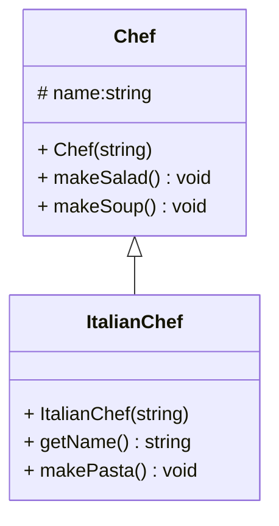

Tässä harjoituksessa opiskellaan perintää ja UML-luokkakaavioiden tulkintaa. Materiaalissa asiaan liittyy kappale Periytyminen ja UML luokkakaavio.

Noudata käytäntöä, että kullekin luokalle luodaan oma header-tiedosto ja oma cpp-tiedosto, joilla on sama nimi kuin luokalla.

# Harjoitus3a (perintä)



**Kantaluokka Chef:**

1. Luotuasi projektin, lisää siihen yllä esitetyn UML-kaavion mukainen luokka Chef. Luo luokka Qt:n toiminnolla "Add New ...C++ Class"

2. Toteuta Chef-luokka niin, että jäsenfunktiot mukaan lukien konstruktori ja destruktori tulostavat debug tietoa ruudulle. Konstruktorille annetaan parametrina kokin nimi.

3. Luo mainissa Chef-luokasta automaattinen olio (pinomuistiin), anna kokin nimeksi Gordon Ramsay

4. Kutsu metodeja makeSalad ja makeSoup

5. Suorita sovellus. Ohjelman tulostuksen pitäisi näyttää seuraavalta: 

```
Chef Gordon Ramsay konstruktori
Chef Gordon Ramsay makes salad
Chef Gordon Ramsay makes soup
Chef Gordon Ramsay destruktori
Press <RETURN> to close this window...
```

**Aliluokka ItalianChef:**

6. Lisää luokka ItalianChef, joka perii luokan Chef

7. Toteuta ItalianChef-luokka niin, että jäsenfunktiot mukaan lukien konstruktori ja destruktori tulostavat debug tietoa ruudulle. Konstruktorille annetaan parametrina kokin nimi. Metodi getName() palauttaa kokin nimen. \
**Huomaa**, että koska Chef-luokan muodostin ottaa parametrin, sinun on kutsuttava ItalianChef luokan konstruktorissa tuota muodostinta

8. Luo mainissa ItalianChef-luokasta automaattinen olio (pinomuistiin), anna kokin nimeksi Anthony Bourdain

9. Kutsu metodeja *makeSalad*, *makeSoup*, *makePasta* ja *getName* (tulosta sen palauttama nimi cout:lla)

10. Suorita sovellus. Ohjelman tulisi tulostaa edellisen lisäksi seuraavaa:

```
Chef Anthony Bourdain konstruktori
ItalianChef Anthony Bourdain konstruktori
Chef Anthony Bourdain makes salad
Chef Anthony Bourdain makes soup
Italian Chef Anthony Bourdain makes pasta
name of the Italian Chef is Anthony Bourdain
ItalianChef Anthony Bourdain destruktori
Chef Anthony Bourdain destruktori
Press <RETURN> to close this window...
```