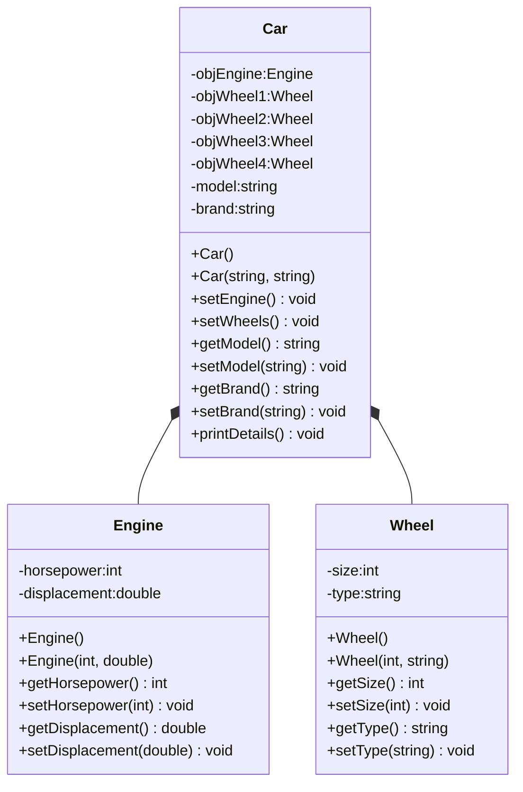

Tässä harjoituksessa opiskellaan vahvaa koostetta(kompositiota) ja UML-luokkakaavion tulkintaa. Harjoituksessa Car-luokan olio luo Engine-luokan olion ja neljä Wheel-luokan oliota. Car-luokka on siis koosteluokka.

Miksi tässä käytetään koostetta eikä perintää?

- Ei voida sanoa, että auto on rengas tai rengas on auto, joten perintä ei tule kysymykseen
- Voidaan sanoa, että autossa on rengas, ja autossa on moottori, siksi siis kooste.

**HUOM!:** Luo kullekin luokalle reillinen h-tiedosto ja cpp-tiedosto.

# Harjoitus4 (kompositio)

Harjoituksessa luotavan sovelluksen luokkakaavio on seuraava:



Tässä tehtävässä tarkoituksena on mallintaa yksinkertainen auton rakenne C++:ssa käyttämällä kompositiota. Sinun tulee luoda luokat *Engine*, *Wheel* ja *Car*, ja yhdistää nämä osat luokkaan *Car* komposition avulla.

1. **Luokan *Engine* toteutus:**
    - Luo luokka *Engine*, joka sisältää seuraavat ominaisuudet:
        - *int horsepower*: moottorin hevosvoimat
        - *double displacement*: moottorin tilavuus litroissa
    - Luo konstruktori ja kaaviossa esitetyt getterit ja setterit yllä oleville ominaisuuksille.
2. **Luokan *Wheel* toteutus:**
    - Luo luokka *Wheel*, joka sisältää seuraavat ominaisuudet:
        - *int size*: renkaan koko (esim. tuumina)
        - *string type*: renkaan tyyppi (esim. "kesärengas" tai "talvirengas")
    - Luo konstruktori ja kaaviossa esitetyt getterit ja setterit yllä oleville ominaisuuksille
3. **Luokan *Car* toteutus:**
    - Luo luokka *Car*, joka koostuu seuraavista osista:
        - Yksi *Engine*-olio
        - Neljä *Wheel*-oliota
        - *string model*: auton malli
        - *string brand*: auton merkki
    - Luo konstruktori ja kaaviossa esitetyt getterit ja setterit yllä oleville ominaisuuksille
    - Aseta metodissa setEngine moottorille ominaisuudet: hevosvoimia=150 ja moottorintilavuus=2.0
    - Aseta metodissa setWheels kullekin renkaalle ominaisuudet: koko=17 ja tyyppi=kesarengas
    - Toteuta metodi *void printDetails()*, joka tulostaa auton tiedot, mukaan lukien moottorin ja renkaiden tiedot (katso mallia esimerkkitulosteesta alla)
4. **Pääohjelma:**
    - Luo mainissa
        - Car-olio (brand Toyota ja model Corolla)
        - Kutsu Car-olion setEngine metodia
        - Kutsu Car-olion setWheels metodia
        - Tulosta tiedot, jolloin tuloksena tulisi olla seuraavaa:
        ```
        Auto : Corolla Toyota
        Moottori: 150 hp, 2 L
        Rengas 1:17 tuumaa, kesarengas
        Rengas 2:17 tuumaa, kesarengas
        Rengas 3:17 tuumaa, kesarengas
        Rengas 4:17 tuumaa, kesarengas
        Press <RETURN> to close this window...
        ```